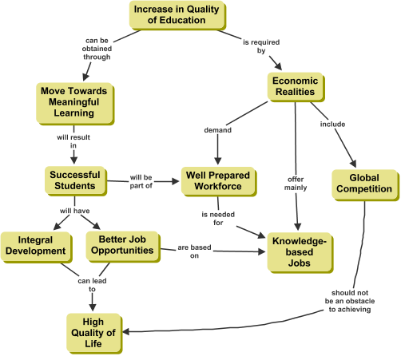

# Concept Maps (AKA Conceptual Diagram)

A concept map is a diagram that depicts the relationships between concepts.

## Terms

- [Concepts](concepts.md#concepts-in-a-concept-map)
- [Relationships](relationships.md#relationship-between-concepts)

## Examples

### Concept map about Birds

### Concept map on Increase in Quality of Education

### Concept map about How a Thermostat Works

