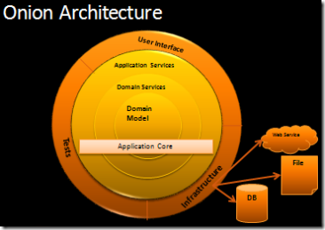
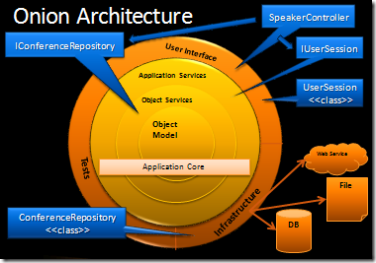
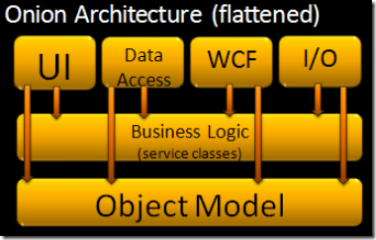

# Onion Architectural Pattern

## Objectives

- Removes the dependencies to the infrastructure

## Concepts

## Characteristics

- Inner layers define interfaces. Outer layers implement interfaces
- All dependencies are toward the center
- Business logic is coupled to the object model
- All application core code can be compiled and run separate from infrastructure
- Depends on an IoC container