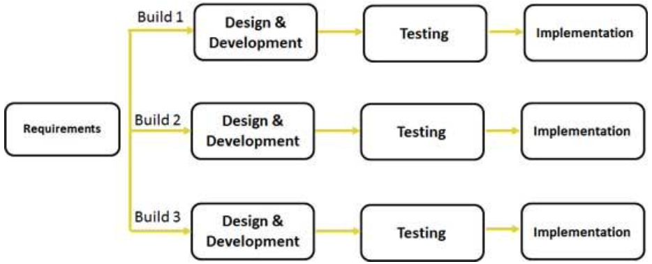

# Incremental Model

## Considerations

- Unchanged and well-understood requirements
- Low cost
- High guarantee of success
- Intermediate simplicity
- Easily managed risk involvement
- High expertise required
- Easy changes incorporated
- No risk analysis
- Not much flexible
- Great in maintance
- Robust integrity and security
- Highly reusable
- Having documentation and training
- Very long time frame