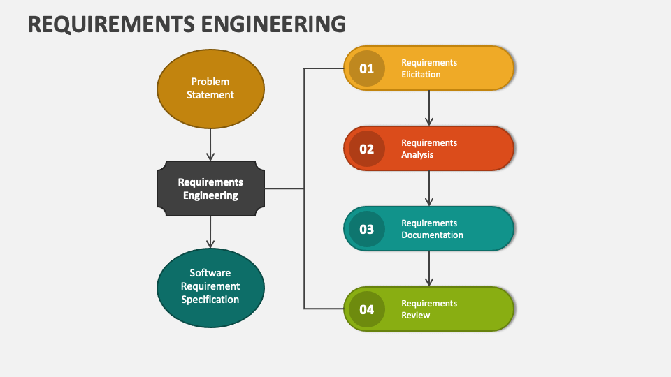

# Requirement Engineering

## Objectives

- Categorize all stakeholder information in a way that allows decision makers to choose an internally consistent set of requirements.

## Steps

- Gather requirements
- Analysis requirements
- Create specifications (an analysis model of information, functional, and behavioral domains)

### Gathering requirements

*AKA Requirement elicitation*

For understanding the business context:
- What is required?
- How the system will fit into the needs of the business?
- How the system will be used on a day-to-day basis?

#### Problem statement

Customer statement of work (aka customer statement of requirements)

#### Issues

- Granularity of requirements

### Analysis requirements

Refine of and reason about collected information from gathering step (define use cases/stories) including negotiation with the customer to determine the priorities, and essential and realistic points.

#### Problem definition

Based on the problem statement, through fact-finding and envisioning

### Creating specifications

Specifications can be
- Written documents
- A set of graphical models
- A formal mathematical model
- A collection of usage scenarios (use cases/stories)
- Prototypes
- Or any combination of these

#### Tools

- UML tools