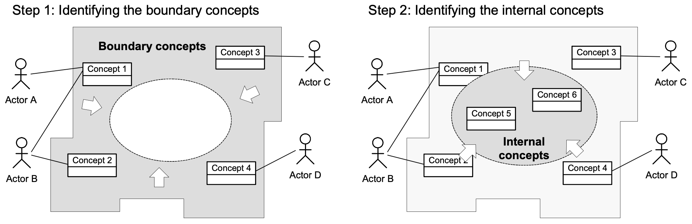

# Requirement Analysis

Refine of and reason about collected information from gathering step (define use cases/stories) including negotiation with the customer to determine the priorities, and essential and realistic points. The result is an analysis model of information, functional, and behavioral domains.

## Build domain model

### Steps

- Identifying concepts (objects)

## In-bound objects

- Front-face objects: Controllers
- Internal objects: Services and other Components

## Out-bound objects

- Actors: Users
- External and third-party systems

## Problem definition

Based on the problem statement, through fact-finding and envisioning

## Practices

- [Domain model](domain-model/README.md)