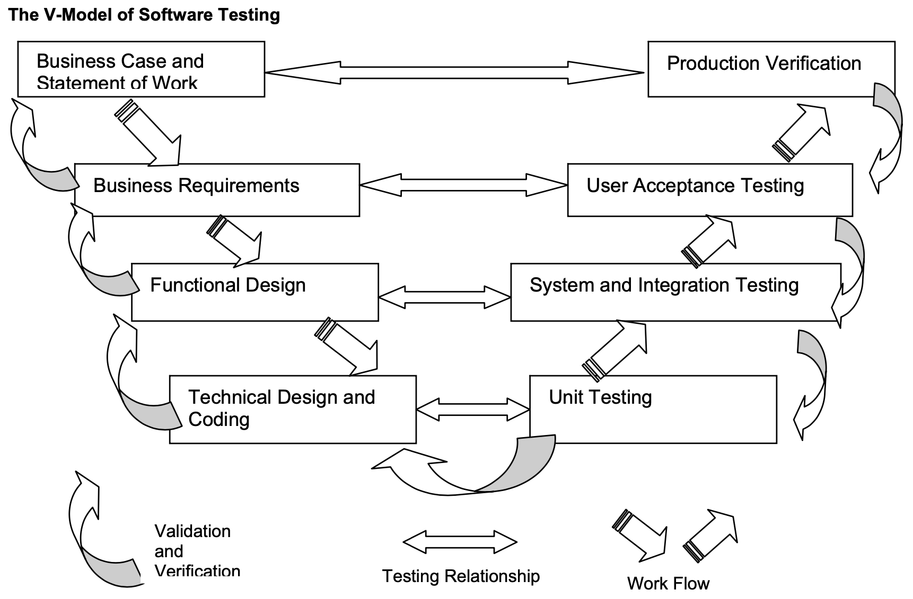

# Software Testing

## What is software testing?

Software testing is a process of verifying and validating the software whether it meets the business and technical requirements based on its design and development and works as expected. If not, it identifies defects, flaws, or errors and what must be fixed, changed, or improved.

## Why do we need software testing?

Finding defects in the final product.

### Benefits

- Save time and money by identifying defects early
- Avoid and reduce development downtime
- Provide better customer service by building better software
- Know that whether we've satisfied our user's requirements
- Know what need to be changed or improved
- Identify and catalog reusable components
- Identify what we (developers) are lack of

## What do we test?

Test what is critical and popular before looking at the "nice-to-have" ones.

The code is bad doesn't mean its behavior is bad.

### Considerations

- Business requirements
- Functional design requirements
- Technical design requirements
- Regulatory requirements
- Programmer code
- System administration standards and restrictions
- Corporate standards
- Professional or trade association best practices
- Hardware configuration
- Cultural issues and language differences

## Defect severities

- Show stopper: cannot continue testing
- Critical: can continue testing but must be fixed before release
- Major: can continue testing but the system doesn't meet many aspects of the business requirements
- Medium: can continue testing but the system doesn't meet some aspects of the business requirements
- Minor: can continue testing but the system meet almost the business requirements
- Cosmetic: often the UI defects, such as colors, fonts, and pitch size that don't affect the business requirements and are not listed in other requirements.

## Test case

A test case defines the expected output of the tested target when we give it a specific input.

## Test

A test is a finite set of related test cases.

## Test types

### By boundary

- White box test
  - Unit test
  - Integration test
  - System test
    - Function test
    - Quality test
- Black box test
  - Acceptance test
  - Installation test

## Test coverage

- Specification coverage
- Code coverage: measures the degree (often percentage) the source code tested

## Considerations

- Find faults as cheaply and quickly as possible.